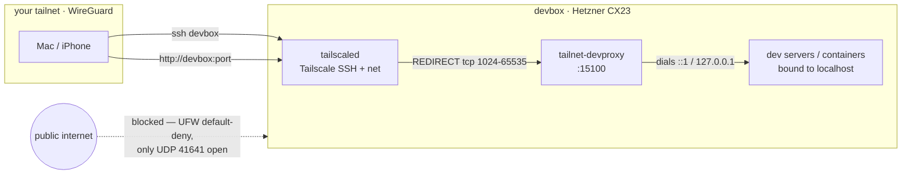

# devbox

[](../../actions/workflows/ci.yml)

A reproducible, tailnet-only development server on Hetzner Cloud. Go from nothing to a
hardened €5.49/month box you reach as `ssh devbox` — no public ports, no SSH keys to
manage, wired for Claude Code — and rebuild the whole thing from this repo in minutes.

- **Tailnet-only.** Zero public TCP ports. Access is Tailscale SSH: your tailnet identity is the credential.
- **Hardened and self-maintaining.** UFW default-deny, key-only sshd, automatic security patches with a nightly reboot window.
- **Self-alerting.** Pushes to your phone when the disk fills or a service fails.
- **Ready for development.** fish + starship, persistent tmux, Node/pnpm, Docker, Claude Code with configurable skills and phone notifications.
- **Instant previews.** `http://devbox:<port>` reaches any dev server or container on the box — even one bound to localhost.



## Architecture

| Layer | Choice | Why |
|---|---|---|
| Access | **Tailscale SSH only** (`ssh devbox`, as `$DEV_USER`) | No SSH keys to manage; auth = tailnet identity; public 22 never opens |
| Firewall | UFW default-deny; only 41641/udp public | Everything else rides the tailnet interface |
| Hardening | key-only sshd (defense in depth), unattended-upgrades + 04:00 auto-reboot | Self-patching; nothing listens publicly, so no ban-daemon needed |
| Sessions | tmux auto-attach on SSH + resurrect/continuum | Survives disconnects *and* the 04:00 patch reboots |
| Localhost preview | iptables(-nft) REDIRECT → `tailnet-devproxy.py` (SO_ORIGINAL_DST) | `http://devbox:<port>` works even for servers bound to `127.0.0.1`/`::1` |
| Containers | Docker + Compose, publishes default to `127.0.0.1` | Containers stay off the internet (Docker bypasses UFW — see FOOTGUNS); the tailnet reaches them via the devproxy |
| Self-alerting | hourly root timer → Pushover | Pushes only on trouble: disk ≥85% or a failed unit, repeating hourly until fixed |
| Notifications | Claude Code hooks → Pushover | Presence-aware; includes turn-failure alerts |
| Recovery | Hetzner rescue mode / console | No credentials live on the box; reset root via Hetzner if ever needed |

## Prerequisites

**On your machine:** `curl`, `jq`, `git`, `ssh` (all stock), plus Tailscale running and
logged in. For the code sync, your `~/Code` tree. Every knob — server name, dev user,
location, Claude skills — lives in `secrets.env`.

**On your tailnet:** MagicDNS on (so `$DEV_USER@devbox` resolves) and Tailscale SSH
allowed by your ACLs. Both are on by default for new tailnets; `make preflight` checks them.

## Quick start

```sh
cp secrets.env.example secrets.env   # fill in HCLOUD_TOKEN + TS_AUTHKEY, tweak DEV_USER etc.
make preflight                       # validate token, tailnet, and name before spending anything
make provision                       # create the server; cloud-init hardens it and joins the tailnet (~5-10 min)
make setup                           # user environment: fish, tmux, Node, Claude Code, hooks (idempotent)
make sync                            # mirror ~/Code repos and .env files (after the one-time auth below)
```

`make provision` runs `preflight` first, so a missing prerequisite stops you in seconds
rather than partway through a paid server.

## One-time authentication

Three logins happen in your browser and can't be scripted. Do them once per box:

| Step | Where | What it does |
|---|---|---|
| `gh auth login` | on devbox | GitHub device flow — gives the box its own revocable token |
| `claude` → login | on devbox | Claude subscription OAuth |
| Disable key expiry | [Tailscale admin](https://login.tailscale.com/admin/machines) → devbox → ⋯ | Keeps the node key (and thus SSH) from expiring in ~180 days |

Set up the Pushover app and account to receive notifications (keys go in `secrets.env`),
and revoke `HCLOUD_TOKEN` from the Hetzner console once you're done provisioning.

Optional: enable **Tailscale Serve** on your tailnet for HTTPS preview URLs — nothing here depends on it.

## Daily use

- **`ssh devbox`** lands you in fish inside a persistent tmux session. Detach with `Ctrl-b d`,
  split with `Ctrl-b |` / `Ctrl-b -`, new window with `Ctrl-b c`. Mouse works and selections
  copy to your local clipboard. Sessions survive network drops and the nightly reboot — layouts
  restore, and `claude --continue` resumes a conversation. Use `mosh devbox` on flaky networks.
- **`http://devbox:<port>`** opens any dev server from any tailnet device — no flags, no tunnels —
  including localhost-only binds and Docker publishes. For HTTPS (secure cookies, service workers),
  run `tailscale serve --bg <port>` for `https://<name>.<tailnet>.ts.net`, and `tailscale serve off` when done.
- **`docker run -p 8080:80 …`** publishes to loopback, so containers are reachable at `devbox:8080`
  over the tailnet and invisible to the internet. Publishing to `0.0.0.0` bypasses this — see FOOTGUNS.
- **`claude` in any repo** pushes to your phone when it finishes or needs input (and stays quiet
  while you're typing in tmux). A **"devbox health"** push is the hourly monitor flagging low disk
  or a failed unit.

## Rebuild and teardown

```sh
make destroy                 # delete the server (prompts for the name); billing stops immediately
FORCE=1 make destroy         # skip the prompt      ·      DRY_RUN=1 make destroy   to preview
```

`destroy` deletes the Hetzner server and clears the local SSH host key. Removing the Tailscale
node is the one manual step — the script prints the link. Skip it and a rebuild registers as
`<name>-1`, which breaks MagicDNS.

To rebuild: `make destroy`, remove the tailnet node, generate a fresh `TS_AUTHKEY`, then run the
quick start again. `make setup` is also safe to re-run any time to converge config drift on a live box.

## Not included, by design

- **Hetzner backups** — a per-box billing decision (+20%, one API call or console toggle).
- **Project data** — repos and `.env` files are mirrored; databases and runtime state are not.
- **Shared credentials** — every box gets its own GitHub and Claude logins, revocable independently.

## More

- [docs/FOOTGUNS.md](docs/FOOTGUNS.md) — the non-obvious behaviors and the reasoning behind each design choice.

## License

MIT — see [LICENSE](LICENSE).
