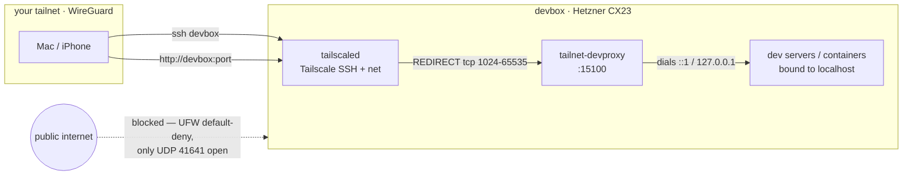

# devbox

[](../../actions/workflows/ci.yml)

Reproduces a personal Hetzner development server from zero: a €5.49/mo CX23 in Falkenstein
that is **tailnet-only** (zero public TCP ports), hardened, self-patching, and
**self-alerting** — it pushes to your phone when something's wrong. Fully kitted for
development: fish + starship, persistent tmux, Node/pnpm, **Docker** (containers can't
face the internet by default), Claude Code with configurable skills and phone
notifications, and a transparent proxy that makes `http://devbox:<port>` reach anything
listening on the box — bare process or container, even bound to localhost (unprivileged
ports, ≥1024). Tools install at their latest versions on rebuild day — configs are
pinned, versions are not.



## Architecture (what you get)

| Layer | Choice | Why |
|---|---|---|
| Access | **Tailscale SSH only** (`ssh devbox`, as `$DEV_USER`) | No SSH keys to manage; auth = tailnet identity; public 22 never opens |
| Firewall | UFW default-deny; only 41641/udp public | Everything else rides the tailnet interface |
| Hardening | key-only sshd (defense in depth), unattended-upgrades + 04:00 auto-reboot | Self-patching; nothing listens publicly, so no ban-daemon needed |
| Sessions | tmux auto-attach on SSH + resurrect/continuum | Survives disconnects *and* the 04:00 patch reboots |
| Localhost preview | iptables(-nft) REDIRECT → `tailnet-devproxy.py` (SO_ORIGINAL_DST) | `http://devbox:<port>` works even for servers bound to `127.0.0.1`/`::1` |
| Containers | Docker + Compose, publishes default to `127.0.0.1` | Containers don't face the internet by default (Docker bypasses UFW — see FOOTGUNS); tailnet reaches them via the devproxy |
| Self-alerting | hourly root timer → Pushover | Pushes only on trouble: disk ≥85% or failed system units, re-alerting hourly until fixed |
| Notifications | Claude Code hooks → Pushover | Presence-aware; includes StopFailure (API-error) alerts |
| Recovery | Hetzner rescue mode / console after a root-password reset | No credentials exist on the box — reset via Hetzner first |

## Prerequisites

On the Mac: `curl`, `jq`, `git`, `ssh` (all stock), Tailscale running and logged in,
and — for the code sync — your `~/Code` tree. All knobs (server name, dev user,
location, Claude skills to install) live in `secrets.env`.

On the tailnet (hard requirements — provision's wait loop depends on them):
**MagicDNS on** (`$DEV_USER@devbox` must resolve) and **Tailscale SSH permitted by the
ACLs** (the default policy allows it). Verify both for your tailnet (new tailnets have them by default).

## Provision

```sh
cp secrets.env.example secrets.env   # fill in HCLOUD_TOKEN + TS_AUTHKEY
make provision                       # create server; cloud-init hardens + joins tailnet (~5-10 min)
make setup                           # user env: fish/tmux/node/claude/hooks (idempotent, re-runnable)
# one-time interactive auth on the box (see below), then:
make sync                            # mirror ~/Code repos + .env files
```

## Manual steps (unavoidable — interactive auth)

| Step | Where | Why it can't be automated |
|---|---|---|
| `gh auth login` | on devbox | GitHub device-code flow (gives the box its own revocable token) |
| `claude` → login | on devbox | Claude subscription OAuth in your browser |
| Disable key expiry | [Tailscale admin](https://login.tailscale.com/admin/machines) → devbox → ⋯ | Node key otherwise expires in ~180 days, killing the only SSH path |
| Notification devices | Pushover app + account (keys in secrets.env) | Phone-side app state can't be provisioned from here |
| Revoke `HCLOUD_TOKEN` | Hetzner console | Nothing needs it after provisioning |

Optional tailnet extra: **Tailscale Serve** for HTTPS preview URLs — one-time enable
per tailnet; nothing in this repo depends on it.

## Daily use

- **`ssh devbox`** — lands in fish inside a persistent tmux session. Detach `Ctrl-b d`,
  split `Ctrl-b |` / `Ctrl-b -`, new window `Ctrl-b c`; mouse works, selections land in
  your Mac clipboard (OSC 52). Sessions survive network drops and the 04:00 reboots
  (layouts restore; restart long-running programs, `claude --continue` picks up where
  it left off). `mosh devbox` for flaky networks.
- **`http://devbox:<port>`** — open any dev server from any tailnet device, no flags,
  no tunnels; works for localhost-only binds and Docker publishes alike. Need real
  HTTPS (secure cookies, service workers)? `tailscale serve --bg <port>` →
  `https://<name>.<tailnet>.ts.net`, `tailscale serve off` when done (no sudo needed).
- **`docker run -p 8080:80 …`** — publishes bind loopback, so containers are
  tailnet-visible at `devbox:8080` and invisible to the internet. Never publish with
  an explicit `-p 0.0.0.0:` (see FOOTGUNS).
- **`claude` in any repo** — your phone gets a push when it finishes or needs input
  (suppressed while you're typing in tmux). A push titled **"devbox health: …"** is
  different: that's the hourly health timer — disk filling up or a failed unit.
  Investigate promptly.

## Rebuilding

`provision.sh` refuses to run if a server named `$DEVBOX_NAME` exists. To rebuild:
delete the server in Hetzner, **delete the old node in the Tailscale admin console**
(otherwise the new node becomes `devbox-1` and every `devbox` reference breaks),
generate a fresh `TS_AUTHKEY`, then run the three steps above.

`setup-user.sh` is safe to re-run any time to converge config drift on a live box.

## What is deliberately NOT here

- **Hetzner backups** — decide per-rebuild (+20% ≈ €1.10/mo, one API call or console toggle).
- **Project data** (databases, `./data` dirs) — repos and `.env` files are mirrored; runtime state is not.
- **Claude/gh credentials** — each box gets fresh, independently-revocable logins.

See [docs/FOOTGUNS.md](docs/FOOTGUNS.md) before changing anything — every entry
in that file cost real debugging time.

## License

MIT — see [LICENSE](LICENSE).
